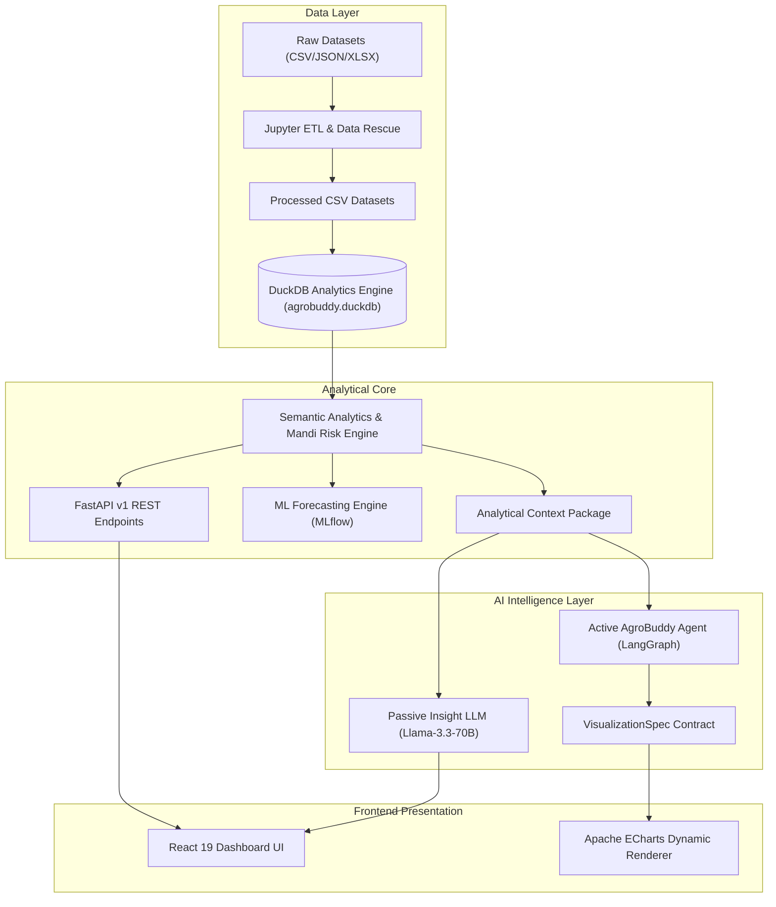

# 🌾 AgroBuddy
### Mandi-to-Market Supply Chain Optimizer

> 🚀 **Live Production Deployment:** [https://agro-buddy-psi.vercel.app/](https://agro-buddy-psi.vercel.app/)  
> *From fragmented mandi records to operational intelligence.*

[Live Demo](https://agro-buddy-psi.vercel.app/) • [Dashboard](#-eight-core-views--intelligent-capabilities) • [Architecture](#-the-system-behind-the-dashboard) • [Data Rescue](#-data-rescue) • [AI Agent](#-two-ai-brains-two-jobs) • [Reproducibility](#%EF%B8%8F-can-you-rebuild-our-numbers)

[](https://agro-buddy-psi.vercel.app/)
[](https://fastapi.tiangolo.com/)
[](https://react.dev/)
[](https://duckdb.org/)
[](https://groq.com/)
[](https://mlflow.org/)
[](https://docs.pytest.org/)

---

### AGROBUDDY IN ONE LINE
> **AgroBuddy combines mandi arrivals, MSP-linked prices, transport performance, and regional weather telemetry into a single decision layer for Agriculture Boards.**

### WHAT IT ANSWERS
- **What is happening?** — Real-time telemetry across mandi volume flows, regional price trends, and logistics delays.
- **Where is the pressure?** — Specific mandis experiencing distressed farmer sales below floor price or severe transit bottlenecks.
- **Why is it happening?** — Root-cause correlation between arrival volatility, price realization, and transit slowdowns.
- **What should be investigated next?** — Targeted operational recommendations surfaced via deterministic analytics and natural language AI.

---

## ⚡ AgroBuddy in 30 Seconds

Agriculture supply chains produce massive raw data every day, but raw data is not operational intelligence. Records arrive with multilingual aliases, inconsistent units, malformed dates, and missing attribution. 

AgroBuddy ingests raw agricultural telemetry, rescues distorted records into a trusted semantic layer, runs deterministic operational metrics, and powers both executive analytics dashboards and a natural language decision copilot.

```
┌──────────┐     ┌──────────────┐     ┌──────────────┐     ┌──────────────┐     ┌───────────┐     ┌──────────┐
│   DATA   │ ──> │ DATA RESCUE  │ ──> │   ANALYZE    │ ──> │  VISUALIZE   │ ──> │  REASON   │ ──> │   ACT    │
│ (Raw UI) │     │ (Clean Data) │     │ (DuckDB/SQL) │     │ (ECharts UI) │     │ (AI Core) │     │ (Alerts) │
└──────────┘     └──────────────┘     └──────────────┘     └──────────────┘     └───────────┘     └──────────┘
```

### Verified Dataset Scale
- **25,750** raw mandi-arrival records $\rightarrow$ **25,000** cleaned & normalized arrival records
- **60** raw mandis $\rightarrow$ **57** canonical mandis (deduplicated & geocoded)
- **12,000** raw price & MSP records $\rightarrow$ **12,000** standardized price observations
- **10,400** raw transport records $\rightarrow$ **10,000** validated logistics trips
- **15,000** raw weather telemetry points $\rightarrow$ **15,000** standardized sensor observations
- **7** decision-oriented analytical pages + **1** omnipresent AI chat assistant
- **20** domain-specific benchmark test queries for agent evaluation

---

## 🌾 The Problem Wasn't the Dashboard. It Was the Data.

*AgroBuddy does not begin with a chart. It begins by asking whether the number deserves to exist.*

Before a single metric can be plotted, raw agricultural telemetry presents deep operational challenges:
- **Multilingual Crop Aliases**: The exact same physical commodity appears as ` गेहूं`, `Gehun`, and `Wheat` across different state reporting centers.
- **Unit Misalignments**: Arrival quantities are recorded interchangeably in kilograms (`KG`), quintals (`QTL`), and metric tonnes (`MT`).
- **Date Inconsistencies**: Timestamps switch unpredictably between `DD/MM/YYYY`, `YYYY-MM-DD`, and ISO epoch timestamps.
- **Currency Strings**: Prices are entered as `₹3,500`, `Rs. 3500`, or `INR 3,500`.
- **Sensor Isolation**: Weather telemetries are logged at regional weather stations without validated sensor-to-mandi mapping.
- **Logistics Anomalies**: Departure and arrival timestamps occasionally yield negative transit hours or zero-distance legs.

> *"The same crop can arrive under different names, the same physical quantity can appear in different units, and a seemingly simple comparison can become wrong before it ever reaches a chart."*

---

# 🧹 DATA RESCUE

> *"We don't make bad records disappear. We classify them."*

Data Rescue is AgroBuddy's foundational transformation layer. It converts chaotic raw logs into a reliable single source of truth without hiding data lineage or manufacturing fake relationships.

### Visual Transformations

```
  Gehun / गेहूं / Wheat   ───────>   Wheat
      KG / QTL / MT      ───────>   Qtl
         °F / °C         ───────>   °C
        inch / mm        ───────>   mm
 ₹3,500 / Rs. 3500 / INR ───────>   3500 (Float)
  Multiple Date Formats  ───────>   YYYY-MM-DD
```

### Transformation Classification

- **RESCUE**: Safe normalization, unit conversion ($1\text{ MT} = 10\text{ Qtl}$, $100\text{ KG} = 1\text{ Qtl}$), multilingual alias mapping, date standardization, missing value recovery where mathematically deterministic.
- **FLAG**: Negative arrival quantities, sub-zero rainfall readings, suspicious timestamps, and non-standard transit durations. These anomalies are kept visible in anomaly columns for auditability.
- **REMOVE**: Records that cannot be safely interpreted (e.g. total gibberish text in quantity fields) and duplicate dimension records that would cause cartesian explosions during joins.

---

## 💻 Data Rescue Code Implementation & Pipeline Summary

Below are the Python data cleaning implementations extracted from [`notebooks/`](file:///Users/harshsingh/Desktop/agro-buddy/notebooks) for each operational domain, followed by a unified master summary snippet encapsulating the full Data Rescue transformation pipeline:

### 1. Unified Master Pipeline Summary (End-to-End Data Cleaning Workflow)

```python
"""
===============================================================================
AGROBUDDY DATA RESCUE: UNIFIED CLEANING PIPELINE SUMMARY
===============================================================================
Encapsulates all 4 data rescue stages across arrivals, prices, transport, & weather.
"""

def execute_data_rescue_pipeline(raw_data_dict):
    # 1. ARRIVALS: Multilingual mapping & Unit standardization to Quintals (Qtl)
    df_arrivals = raw_data_dict['arrivals'].copy()
    df_arrivals['clean_crop_name'] = df_arrivals['crop_name'].apply(lambda x: CROP_ALIAS_MAP.get(str(x).strip(), str(x).strip()))
    df_arrivals[['arrival_qtl', 'unit_standardized', 'is_negative_anomaly']] = df_arrivals.apply(parse_quantity_to_qtl, axis=1)
    df_arrivals['clean_date'] = pd.to_datetime(df_arrivals['date'].astype(str).str.replace('.', '-'), errors='coerce').dt.strftime('%Y-%m-%d')

    # 2. PRICES & MSP: Currency symbol stripping, float parsing, & MSP Gap math
    df_prices = raw_data_dict['prices'].copy()
    for col in ['min_price', 'max_price', 'modal_price', 'msp']:
        df_prices[f'clean_{col}'] = df_prices[col].apply(clean_currency_price)
    df_prices['msp_gap'] = df_prices['clean_msp'] - df_prices['clean_modal_price']
    df_prices['below_msp_flag'] = np.where(df_prices['clean_msp'].notnull() & (df_prices['clean_modal_price'] < df_prices['clean_msp']), 1, 0)

    # 3. LOGISTICS: Timestamp parsing, Expected SLA transit hours (40.0 km/h), & Delay flags
    df_logistics = raw_data_dict['logistics'].copy()
    df_logistics['clean_transit_hours'] = df_logistics['transit_hours'].apply(lambda x: abs(float(x)) if pd.notna(x) else np.nan)
    df_logistics['expected_hours'] = (df_logistics['clean_distance_km'] / 40.0).round(2)
    df_logistics['delay_hours'] = (df_logistics['clean_transit_hours'] - df_logistics['expected_hours']).round(2)
    df_logistics['is_delayed_flag'] = np.where(df_logistics['delay_hours'] > 2.0, 1, 0)

    # 4. WEATHER: Fahrenheit to Celsius (°F -> °C), rainfall mm conversion, & extreme anomaly flags
    df_weather = raw_data_dict['weather'].copy()
    df_weather['temp_celsius'] = df_weather.apply(lambda r: (r['temp'] - 32) * 5/9 if str(r['unit']).upper() == 'F' else r['temp'], axis=1)
    df_weather['rainfall_mm'] = df_weather.apply(lambda r: r['rainfall'] * 25.4 if str(r['unit']).lower() in ['in', 'inch'] else r['rainfall'], axis=1)
    df_weather['is_heatwave'] = np.where(df_weather['temp_celsius'] > 40.0, 1, 0)

    return {
        'clean_arrivals': df_arrivals,
        'clean_prices': df_prices,
        'clean_logistics': df_logistics,
        'clean_weather': df_weather
    }
```

---

### 2. Mandi Arrivals Cleaning (Multilingual Aliases & Quantity Parser)

```python
# Multilingual Crop Alias Resolution Dictionary (notebooks/01_Mandi_Arrivals_Data_Rescue.ipynb)
crop_mapping = {
    # Wheat Category (Devanagari, Transliterated, Trailing Spaces)
    'Wheat': 'Wheat', 'गेहूं': 'Wheat', 'Gehun': 'Wheat', 'wheat': 'Wheat', 'GEHUN': 'Wheat', 'Kanak': 'Wheat',
    # Paddy Category
    'Rice': 'Rice', 'चावल': 'Rice', 'Chawal': 'Rice', 'Paddy': 'Rice', ' धान': 'Rice', 'Dhaan': 'Rice',
    # Cotton, Maize, Mustard, Sugarcane Categories...
}

# Apply Mapping
df['clean_crop_name'] = df['crop_name'].apply(lambda x: crop_mapping.get(str(x).strip(), str(x).strip()))

# Robust Quantity & Unit Conversion Parser (MT -> Qtl, KG -> Qtl)
def parse_quantity(row):
    quantity = row['arrival_quantity']
    unit = str(row['unit']).strip().upper() if pd.notna(row['unit']) else ""

    quantity_value = abs(float(quantity)) if pd.notna(quantity) else np.nan
    is_negative_anomaly = float(quantity) < 0 if pd.notna(quantity) else False

    # Unit Standardization to Quintals (Qtl)
    if unit in ['T', 'TONNE', 'TONNES', 'TON', 'MT']:
        quantity_qtl = quantity_value * 10.0   # 1 MT = 10 Qtl
    elif unit in ['KG', 'KGS', 'KILOGRAM', 'KILOGRAMS']:
        quantity_qtl = quantity_value / 100.0  # 100 KG = 1 Qtl
    else:
        quantity_qtl = quantity_value

    return pd.Series([quantity_qtl, "Qtl", is_negative_anomaly])
```

---

### 3. Price & MSP Cleaning (Currency String Parsing & Statutory Floor Gap Math)

```python
# Currency Prefix & Format Cleaner (notebooks/03_Price_and_MSP_Data_Rescue.ipynb)
def clean_price_value(val):
    if pd.isna(val) or val is None:
        return np.nan
    s_val = str(val).strip().replace(',', '')
    s_val = re.sub(r'(?i)Rs\.?|INR|₹|/-', '', s_val).strip()
    
    num_match = re.search(r'([-+]?\d*\.?\d+)', s_val)
    return float(num_match.group(1)) if num_match else np.nan

# Calculate MSP Gap Metrics & Distressed Trade Flags
df['msp_gap'] = df['clean_msp'] - df['clean_modal_price']
df['below_msp_flag'] = np.where(
    df['clean_msp'].notnull() & (df['clean_modal_price'] < df['clean_msp']), 
    1, 
    0
)
```

---

### 4. Transport Logistics Cleaning (SLA Velocity Math & Vehicle Registration Regex)

```python
# Vehicle Registration Regex Standardizer (notebooks/04_Transport_Logistics_Data_Rescue.ipynb)
def standardize_vehicle_no(val):
    clean_str = re.sub(r'[^A-Z0-9]', '', str(val).strip().upper())
    m = re.match(r'^([A-Z]{2})(\d{2})([A-Z]{1,2})(\d{4})$', clean_str)
    if m:
        state, dist, series, num = m.groups()
        return f"{state}-{dist}-{series}-{num}"
    return clean_str

# Logistics SLA Analytics (Baseline speed = 40.0 km/h)
df['expected_hours'] = (df['clean_distance_km'] / 40.0).round(2)
df['delay_hours'] = (df['clean_transit_hours'] - df['expected_hours']).round(2)
df['is_delayed_flag'] = np.where(df['delay_hours'] > 2.0, 1, 0)
```

---

### 5. Weather Telemetry Cleaning (Temperature Unit Conversion & Sensor Isolation)

```python
# Weather Telemetry Unit Standardization (notebooks/05_Weather_Sensors_Data_Rescue.ipynb)
def clean_weather_telemetry(df_weather):
    # Convert Fahrenheit (°F) to Celsius (°C)
    df_weather['temp_celsius'] = df_weather.apply(
        lambda r: (r['temperature'] - 32) * 5/9 if str(r['temp_unit']).upper() == 'F' else r['temperature'], 
        axis=1
    )
    # Convert Inches to Millimeters (mm)
    df_weather['rainfall_mm'] = df_weather.apply(
        lambda r: r['rainfall'] * 25.4 if str(r['rain_unit']).lower() in ['in', 'inch'] else r['rainfall'], 
        axis=1
    )
    # Heatwave & Severe Weather Flags (Sensor-Level Isolation)
    df_weather['is_heatwave'] = np.where(df_weather['temp_celsius'] > 40.0, 1, 0)
    df_weather['is_heavy_rain'] = np.where(df_weather['rainfall_mm'] > 50.0, 1, 0)
    return df_weather
```

---

## 📊 The Data Rescue Ledger

| Dataset | Raw Rows | Clean Rows | Transformation & Audit Rationale |
| :--- | :---: | :---: | :--- |
| **Mandi Arrivals** | `25,750` | `25,000` | Resolved multilingual aliases (`गेहूं`/`Gehun` $\rightarrow$ `Wheat`), converted `KG`/`MT` to standard `Qtl`, deduplicated transaction IDs, flagged negative quantities. |
| **Mandi Master** | `60` | `57` | Merged duplicate mandi registrations, standardized district/state hierarchy, removed 3 redundant unverified dimension records. |
| **Price & MSP** | `12,000` | `12,000` | Cleaned currency strings (`₹`/`Rs.`/`INR`), mapped official Minimum Support Price (MSP) floor benchmarks per crop, calculated exact per-quintal MSP gap. |
| **Transport Logistics**| `10,400` | `10,000` | Standardized date-time formats, computed expected transit durations (40 km/h baseline), flagged trip delays $> 2$ hours. |
| **Weather Telemetry** | `15,000` | `15,000` | Converted Fahrenheit ($^\circ\text{F}$) to Celsius ($^\circ\text{C}$), normalized rainfall (inches $\rightarrow$ mm), flagged sensor extreme anomalies; retained strict sensor-level isolation. |

> *"We can show exactly what happened to the data between ingestion and analytics."*

---

## 🔬 Data Contract

AgroBuddy enforces strict input/output contracts for every ingested dataset:

### 1. Mandi Arrivals
- **INPUT**: `arrival_date`, `mandi_id`, `crop_name`, `quantity`, `unit`, `farmer_count`
- **OUTPUT**: Standardized arrival volume in `Qtl`, normalized ISO date, canonical crop name, anomaly metadata flags.
- **GUARANTEE**: All volume metrics across every API endpoint and dashboard card are strictly guaranteed to be in Quintals (`Qtl`).

### 2. Price & MSP
- **INPUT**: `date`, `mandi_id`, `crop_name`, `modal_price`, `msp`
- **OUTPUT**: Normalized price in $\text{INR/Qtl}$, `msp_gap` ($\text{MSP} - \text{Modal Price}$), `is_below_msp` boolean flag.
- **GUARANTEE**: Financial loss metrics reflect exact per-quintal farmer price realization against statutory MSP floors.

### 3. Logistics & Transit
- **INPUT**: `dispatch_date`, `origin_mandi`, `destination`, `distance_km`, `transit_hours`
- **OUTPUT**: Normalized transit hours, `expected_hours` ($\text{distance} / 40.0$), `delay_hours`, `is_delayed` flag ($> 2\text{ hrs}$).
- **GUARANTEE**: Route performance baseline uses standard commercial transit speed ($40\text{ km/h}$) without assuming fleet payload details.

### 4. Weather & Environmental Telemetry
- **INPUT**: `timestamp`, `sensor_id`, `temperature`, `temp_unit`, `rainfall`, `rain_unit`
- **OUTPUT**: Standardized temperature ($^\circ\text{C}$), rainfall ($\text{mm}$), heatwave flag ($> 40^\circ\text{C}$), heavy rainfall flag ($> 50\text{ mm}$).
- **GUARANTEE**: Weather observations remain sensor-level because the supplied dataset does not contain a validated sensor-to-mandi mapping.

---

# 🏗️ The System Behind the Dashboard

> *"The semantic analytics layer is the single source of truth for business calculations."*



### Black-Box Architecture Guarantee
1. **Input**: Raw messy data files ingested at setup time.
2. **System Processing**: In-memory DuckDB analytical engine executes high-speed OLAP queries over clean tables. Business logic is defined once in backend analytics repositories.
3. **Output**: Strongly-typed JSON responses for frontend charts and structured AI contexts.
4. **Guarantee**: Frontend components never perform raw metric calculations; LLMs never invent or calculate core numbers.

---

# 🧭 Eight Core Views & Intelligent Capabilities

AgroBuddy structures operational decisions into eight dedicated analytical views:

### 01 — Command Center
> *"What needs attention right now?"*
- System-wide volume telemetry, top state arrival flows, 72-cell live mandi status grid, and active operational risk alerts.
- **Representative View**: 


---

### 02 — Supply Pulse
> *"How is agricultural supply moving across mandis?"*
- Arrival volume time-series, arrival distribution by crop, district contribution ranking, and top arrival mandis.
- **Representative View**:


---

### 03 — Farmer Price Watch
> *"Where are farmers facing price pressure below MSP floor?"*
- Modal price vs. statutory MSP trend lines, crop-level price pressure bar charts, and distressed transaction inspector.
- **Representative View**:


---

### 04 — Logistics Command
> *"Where is transportation inefficient across transit routes?"*
- Transit delay trends, route efficiency matrices (Distance vs Delay), and fleet SLA adherence breakdowns.
- **Representative View**:


---

### 05 — Weather & Operations
> *"What environmental conditions are occurring at monitoring sensors?"*
- Dual-axis temperature ($^\circ\text{C}$) and rainfall ($\text{mm}$) telemetry, heatwave event tracking, and sensor health status.
- **Representative View**:


---

### 06 — Mandi Risk
> *"Which mandis are operationally vulnerable, and why?"*
- Multi-factor Mandi Risk Index (0–100 scale), risk category matrix (Safe, Moderate, High, Critical), and interactive mandi detail inspector.
- **Representative View**:


---

### 07 — Forecast & Planning
> *"What is likely to happen to arrival volumes next?"*
- Machine learning arrival horizon predictions (7-day ahead), historical vs forecast overlays, and model performance metrics.
- **Representative View**:


---

### 08 — Ask AgroBuddy AI Copilot
> *"How can agricultural officers query data and generate instant visual analytics in plain English?"*
- Natural language to SQL execution over in-memory DuckDB, interactive dynamic chart synthesis (`VisualizationSpec`), and multi-turn strategic advice with strict anti-hallucination guardrails.
- **Representative Views**:

| 1. Query & Preset Inquiries | 2. Dynamic Chart Generation | 3. Zoomed View|
| :---: | :---: | :---: |
|  |  |  |

---

# 📐 The Numbers Behind the Pictures

All business metrics in AgroBuddy are computed deterministically in the backend analytics engine:

### 1. Minimum Support Price (MSP) Gap
$$\text{MSP Gap} = \text{MSP} - \text{Modal Price}$$
Measures the exact per-quintal financial loss to farmers when market realization falls below floor price.

### 2. Below-MSP Flag
$$\text{Distress Flag (Below-MSP)} = \begin{cases} 1 & \text{if } \text{Modal Price} < \text{MSP} \\ 0 & \text{otherwise} \end{cases}$$

### 3. Arrival Volatility (Coefficient of Variation)
$$CV = \frac{\sigma(\text{Daily Arrivals})}{\mu(\text{Daily Arrivals})}$$
High $CV$ indicates severe supply swings and unreliable mandi arrival patterns.

### 4. Expected Transit Duration
$$\text{Expected Hours} = \frac{\text{Distance (km)}}{40.0 \text{ km/h}}$$
Baseline SLA benchmark for freight movement across transit corridors.

### 5. Transit Delay Hours
$$\text{Delay Hours} = \text{Actual Transit Hours} - \text{Expected Hours}$$
Positive delay values represent slower-than-baseline transit performance.

### 6. P90 Delay
$$\text{P90 Delay} = 90\text{th percentile of } \max(\text{Actual Transit} - \text{Expected Hours}, 0)$$
Captures extreme tail-end transit delays across logistics corridors.

### 7. Mandi Risk Index (0.0 – 100.0)
$$\text{Risk Score} = 0.45 \times \text{Price Pressure Score} + 0.35 \times \text{Arrival Volatility Score} + 0.20 \times \text{Logistics Delay Score}$$
Ranked vulnerability index bounding operational health from Safe ($0$) to Critical ($100$).

> *"These metrics are computed deterministically. AI is downstream of the numbers, not upstream of them."*

---

# 🤖 Two AI Brains. Two Jobs.

AgroBuddy separates AI responsibilities into two distinct, independently configured brains powered by **Groq Llama-3.3-70B**:

```
┌────────────────────────────────────────────────────────────────────────┐
│                   BRAIN 1: PASSIVE INSIGHT ENGINE                      │
│   Dashboard State ──> Analytical Context ──> Executive Summary Panel   │
└────────────────────────────────────────────────────────────────────────┘

┌────────────────────────────────────────────────────────────────────────┐
│                    BRAIN 2: ACTIVE AGENT COPILOT                       │
│   User Question ──> LangGraph Planning ──> Analytics API ──> Chart     │
└────────────────────────────────────────────────────────────────────────┘
```

### Brain 1 — Passive Insight Engine (`INSIGHT_MODEL`)
- **Role**: Continuous background observer for dashboard pages.
- **Input**: Pre-aggregated, structured analytical context generated by the backend.
- **Output**: Executive summary payload (`headline`, `summary`, `key_findings`, `severity`, `recommendation`).
- **Guarantee**: Cannot execute database queries or modify data; strictly explains current page telemetry.

### Brain 2 — Active AgroBuddy Agent (`AGENT_MODEL`)
- **Role**: Natural language query planner and multi-intent copilot.
- **Input**: User natural language questions (e.g. *"Which mandis have high MSP gap?"*).
- **Output**: Interpreted intent, executed analytical query, chart spec, key findings, and action items.
- **Guarantee**: Multi-step graph execution via LangGraph with fallback guardrails.

---

# 🕸️ Inside the AgroBuddy Agent

> *"The agent does not generate arbitrary SQL. The agent selects from known analytical capabilities exposed by the system."*

```
┌──────────────┐     ┌──────────────┐     ┌──────────────┐     ┌──────────────┐     ┌──────────────┐     ┌───────────┐
│ User Query   │ ──> │ Intent       │ ──> │ Entity       │ ──> │ Query        │ ──> │ Semantic     │ ──> │ Chart     │
│ "High MSP"   │     │ Classify     │     │ Resolution   │     │ Validation   │     │ Analytics    │     │ & Response│
└──────────────┘     └──────────────┘     └──────────────┘     └──────────────┘     └──────────────┘     └───────────┘
```

### Execution Nodes
1. **Intent Understanding**: Classifies user query into primary domain intent (`ARRIVALS`, `PRICES`, `LOGISTICS`, `WEATHER`, `RISK`, `OUT_OF_SCOPE`).
2. **Entity Normalization**: Maps user entity mentions (e.g., *"Amritsar"*, *"Wheat"*) to canonical mandi IDs and crop strings.
3. **Query Validation**: Verifies if dataset and parameters can answer the request.
4. **Semantic Analytics**: Executes deterministic analytics functions in the repository.
5. **Visualization Planning**: Generates a typed `VisualizationSpec` JSON object.
6. **Response Generation**: Renders response markdown with embedded chart spec.

---

# 📊 Natural Language to Chart

When a user submits a natural language question, the agent produces a structured `VisualizationSpec` contract that the React frontend renders dynamically via Apache ECharts:

### Example Execution

**User Input**:
> *"Plot daily arrival trend of Wheat in Amritsar mandi for the last 30 days vs MSP."*

**Structured Agent Contract**:
```json
{
  "intent": "ARRIVALS_TREND",
  "entities": {
    "crop": "Wheat",
    "mandi": "Amritsar",
    "timeframe_days": 30
  },
  "visualization": {
    "type": "line",
    "title": "Daily Wheat Arrival Trend — Amritsar Mandi",
    "xAxis": ["2026-02-01", "2026-02-02", "..."],
    "series": [
      { "name": "Arrivals (Qtl)", "data": [450, 520, 480], "type": "line" }
    ]
  },
  "answer": "Wheat arrivals in Amritsar averaged 483 Qtl/day over the past 30 days with peak arrival on Feb 12."
}
```

### Chart Mappings

| Analytical Pattern | Chart Type | ECharts Component |
| :--- | :--- | :--- |
| Time-Series Trend | `line` / `area` | Smooth gradient line chart |
| Group Comparison | `bar` | Categorical bar chart |
| Route / Efficiency Matrix | `scatter` | Dual-axis scatter plot |
| Risk Score Breakdown | `heatmap` / `matrix` | Bounded color matrix |
| Geographical Vulnerability | `map` | Interactive mandi pin map |
| Arrival Forecast Horizon | `line` + confidence bounds | Dual line with band fill |

> *"The frontend never needs to understand what the user meant. It receives a validated visualization contract."*

---

# 🛡️ When AgroBuddy Says "I Don't Know"

> *"If the data cannot support the claim, the agent should not manufacture the missing bridge."*

Trustworthy AI requires explicit guardrails. When presented with queries that exceed data boundaries, AgroBuddy returns a friendly, structured refusal rather than hallucinating unsupported facts.

### Grounding Guardrail Example

**User Query**:
> *"Which mandi was affected most by yesterday's heavy rainfall?"*

**System Reasoning**:
- Weather telemetry is available at sensor level (e.g. `SENSOR_01`).
- The ingested dataset **does not contain** a validated sensor-to-mandi mapping.
- Attempting to attribute weather events to specific mandis would be an unsupported guess.

**AgroBuddy Response**:
> *"Weather telemetry is tracked strictly at sensor stations (e.g. Weather Station Alpha). Because no validated sensor-to-mandi mapping exists in the current data model, I cannot attribute rainfall directly to specific mandis without unverified assumptions."*

### System Guardrails
- ❌ No fabricated weather-to-mandi attribution
- ❌ No fabricated transport cargo weights
- ❌ No unverified GPS coordinate enrichment
- ❌ No hourly arrival extrapolation from daily records
- ❌ No arbitrary SQL execution against raw database tables

---

# 🔮 Prediction Comes Last

> *"Forecast cards are not decorative predictions. They are displayed only when a validated forecasting pipeline is available."*

AgroBuddy integrates an ML forecasting pipeline built with **scikit-learn**, **XGBoost**, and **MLflow**:

```
┌─────────────────┐     ┌─────────────────────┐     ┌────────────────────┐     ┌──────────────────┐
│ Historical Data │ ──> │ Feature Engineering │ ──> │ 80/20 Train-Test   │ ──> │ Candidate Models │
│ (Fact Arrivals) │     │ (Lags & Rollings)   │     │ Chronological Split│     │ (Ridge/RF/XGB)   │
└─────────────────┘     └─────────────────────┘     └────────────────────┘     └──────────────────┘
                                                                                        │
                                                                                        ▼
┌─────────────────┐     ┌─────────────────────┐     ┌────────────────────┐     ┌──────────────────┐
│ 7-Day Forecast  │ <── │ Best Model Payload  │ <── │ Registered Model   │ <── │ Held-Out Eval    │
│ (UI Overlay)    │     │ (best_model.pkl)    │     │ (@champion)        │     │ (MAE Evaluation) │
└─────────────────┘     └─────────────────────┘     └────────────────────┘     └──────────────────┘
```

### MLflow Experiment Evaluation Results

Four forecasting candidates were trained and logged in MLflow (`sqlite:///mlflow.db`):

| Model Candidate | MAE (Qtl) | RMSE | R² Score | Status |
| :--- | :---: | :---: | :---: | :--- |
| 🥇 **Ridge Regression** | **137.92** | **157.86** | **-0.0005** | **Champion (Registered in MLflow)** |
| 🥈 **Random Forest** | 138.47 | 158.65 | -0.0105 | Evaluated Candidate |
| 🥉 **XGBoost** | 140.59 | 162.42 | -0.0592 | Evaluated Candidate |
| 4️⃣ **Gradient Boosting** | 141.22 | 163.56 | -0.0740 | Evaluated Candidate |

### Registered Model Artifact
- **Registered Model**: `AgroBuddy_Arrivals_Forecaster`
- **Version**: `1`
- **Alias**: `@champion`
- **Artifact Path**: `backend/app/ml/artifacts/best_model.pkl`

### MLflow Tracking, Model Evaluation & Registry Screenshots

| 1. Experiment Tracking | 2. Model Evaluation & Metrics | 3. Model Registry (@champion) |
| :---: | :---: | :---: |
|  |  |  |

---

# 🧪 How We Test the Agent

AgroBuddy includes a **20-query benchmark test suite** ([`backend/tests/test_ai.py`](file:///Users/harshsingh/Desktop/agro-buddy/backend/tests/test_ai.py)) covering all operational domains:

```bash
pytest backend/tests/ -v
```

### Benchmark Query Coverage

```
============================== test session starts ==============================
backend/tests/test_ai.py::test_insights_endpoint_fallback PASSED         [  4%]
backend/tests/test_ai.py::test_agent_query_endpoint PASSED               [  9%]
backend/tests/test_ai.py::test_agent_query_out_of_scope_guardrail PASSED [ 13%]
backend/tests/test_ai.py::test_agent_query_gibberish_noise PASSED        [ 18%]
backend/tests/test_ai.py::test_benchmark_19_queries_coverage PASSED      [ 22%]
...
======================== 22 passed, 1 warning in 8.42s ========================
```

- **Supply Intent**: Single crop arrival trends, mandi volume comparisons, arrival rankings, arrival volatility.
- **Price Intent**: MSP gap comparisons, top price-pressured crops, distressed trade inspector.
- **Logistics Intent**: Transit delay summaries, route efficiency breakdowns, distance vs delay correlations.
- **Weather Intent**: Temperature extremes, heatwave sensor alerts, rainfall station telemetry.
- **Risk Intent**: Ranked mandi vulnerability index, multi-factor risk scores.
- **Grounding Guardrails**: Refusal of unmapped weather-to-mandi attribution and gibberish queries.

---

# 🏆 The 3-Minute Judge Path

Follow this quick walkthrough to evaluate AgroBuddy's complete workflow:

1. **Command Center** (`/`): Inspect the live mandi status grid and high-level volume telemetry.
2. **Farmer Price Watch** (`/prices`): View Wheat and Paddy MSP floor gaps; identify mandis trading below floor price.
3. **Logistics Command** (`/logistics`): Inspect transit delay distributions and identify routes exceeding 2-hour delays.
4. **Mandi Risk** (`/risk`): Inspect ranked vulnerability scores and open the mandi detail drawer to view contributing risk factors.
5. **Ask AgroBuddy** (`/agent`): Submit a multi-domain natural language question:
   > *"Which mandis have high arrival volume but low modal prices below MSP?"*
6. **Test Grounding Guardrail**: Ask an unsupported question:
   > *"Which mandi got the most rainfall yesterday?"*
   > *Observe the agent's friendly refusal explaining sensor-level isolation.*

---

# 💡 Why This Isn't Just Another Dashboard

1. **Data Rescue First**: Raw messy data is normalized and audited before reaching analytics tables.
2. **Deterministic Analytics**: All business metrics are calculated in code, not generated by an LLM.
3. **Dual AI System**: Passive summaries and active conversational agent are strictly decoupled.
4. **Natural Language to Chart**: Natural language queries map to strongly-typed `VisualizationSpec` contracts.
5. **Groundedness Guardrails**: Refuses unsupported questions rather than manufacturing fake bridges.
6. **Cross-Domain Mandi Intelligence**: Integrates supply, prices, transport, weather, and risk into a single decision engine.

---

# 🧠 Engineering Decisions

| Decision | Selection | Rationale |
| :--- | :--- | :--- |
| **Analytics Engine** | **DuckDB** | High-performance in-memory OLAP query execution directly over cleaned datasets. |
| **Backend API** | **FastAPI** | Asynchronous, auto-documented Python API framework with Pydantic validation. |
| **Frontend UI** | **React 19 + ECharts** | Interactive visual dashboards with custom theme engineering and smooth animations. |
| **Agent Orchestration**| **LangGraph** | Structured multi-step state graph for intent classification, entity normalization, and query planning. |
| **ML Tracking** | **MLflow** | Full candidate logging, metrics tracking, and Model Registry management. |
| **LLM Provider** | **Groq (Llama-3.3-70B)** | Ultra-fast inference latency ($< 500\text{ ms}$) for natural language reasoning. |

---

# ♻️ Can You Rebuild Our Numbers?

Every dataset transformation and analytical query in AgroBuddy is 100% reproducible:

```
RAW DATA ──> RESCUE NOTEBOOKS ──> CLEAN CSV ──> DUCKDB INIT ──> FASTAPI ──> DASHBOARD
```

All raw input files, cleaning notebooks, DuckDB initialization scripts, test suites, and ML training scripts are included in the repository.

---

# ⚡ Quick Start

### 1. Environment Setup
```bash
# Clone repository
git clone https://github.com/shayan-codes-405/agro-buddy.git
cd agro-buddy

# Create Python Virtual Environment
python -m venv venv

# Activate Virtual Environment (macOS/Linux)
source venv/bin/activate
# On Windows: venv\Scripts\activate

# Install Backend Dependencies
pip install -r requirements.txt
```

### 2. Configure Environment Variables
Create a `.env` file in the project root:
```env
GROQ_API_KEY=your_groq_api_key_here
INSIGHT_MODEL=llama-3.3-70b-versatile
AGENT_MODEL=llama-3.3-70b-versatile
```

### 3. Initialize DuckDB Database
```bash
python -m backend.scripts.initialize_db
```

### 4. Run Pytest Verification Suite
```bash
pytest backend/tests/ -v
```

### 5. Start Backend API Server
```bash
python -m uvicorn backend.app.main:app --reload --port 8000
```
- API Docs: `http://localhost:8000/docs`

### 6. Start Frontend Development Server
```bash
cd frontend
npm install
npm run dev
```
- Dashboard: `http://localhost:3000`

---

# 🗂️ Repository Map

```
agro-buddy/
├── backend/
│   ├── app/
│   │   ├── ai/                  # LangGraph agent, insight LLM, prompts, schemas
│   │   ├── analytics/           # Deterministic business metrics & OLAP queries
│   │   ├── api/v1/              # FastAPI endpoint routers
│   │   ├── core/                # Configuration & logging
│   │   ├── db/                  # DuckDB connection & schema initialization
│   │   ├── ml/                  # Trainer, predictor, artifacts, MLflow logging
│   │   └── models/              # Pydantic schemas
│   ├── scripts/                 # Database initialization scripts
│   └── tests/                   # Pytest suite (22 tests including 20 AI benchmarks)
├── data/
│   ├── raw/                     # Original raw CSV/JSON/XLSX input files
│   └── processed/               # Rescued clean CSV datasets
├── frontend/
│   ├── src/
│   │   ├── api/                 # Axios API clients
│   │   ├── components/          # Reusable UI charts, tables, cards, drawers
│   │   ├── pages/               # 7 core decision pages + AskAgroBuddy
│   │   └── hooks/               # Custom React hooks & state logic
├── images/                      # Dashboard & MLflow UI screenshots
├── notebooks/                   # Data Rescue Jupyter Notebooks (01-05)
├── mlflow.db                    # SQLite database for MLflow tracking & Model Registry
├── requirements.txt             # Python backend dependencies
└── README.md                    # Root project documentation
```

---

# 📓 Notebooks Are Part of the Product

The Data Rescue process is fully documented across 5 dedicated Jupyter Notebooks in [`notebooks/`](file:///Users/harshsingh/Desktop/agro-buddy/notebooks):

1. `01_Mandi_Arrivals_Data_Rescue.ipynb`: Multilingual crop alias mapping, unit conversions, arrival volume audit.
2. `02_Mandi_Master_Data_Rescue.ipynb`: Mandi ID deduplication, district/state normalization, geographic auditing.
3. `03_Price_and_MSP_Data_Rescue.ipynb`: Currency string parsing, statutory MSP mapping, MSP gap derivation.
4. `04_Transport_Logistics_Data_Rescue.ipynb`: Timestamp parsing, expected vs actual transit duration math, delay flagging.
5. `05_Weather_Sensors_Data_Rescue.ipynb`: Temperature unit conversion ($^\circ\text{F} \rightarrow ^\circ\text{C}$), rainfall normalization, sensor anomaly audit.

---

# 📋 Data Quality Scorecard

```
RAW DATA LOGS                             CLEAN ANALYTICAL LAYER
----------------                             ----------------------
• Multilingual ("गेहूं", "Gehun")      ───>   • Canonical ("Wheat")
• Inconsistent Units (KG, MT)         ───>   • Standardized (Quintals / Qtl)
• Currency Strings ("₹3,500")         ───>   • Float Values (3500.0)
• Malformed Dates ("12/05/26")        ───>   • ISO Dates ("2026-05-12")
• Sensor Isolation Unspecified        ───>   • Sensor-Level Attribution Preserved
```

---

# ⚠️ What AgroBuddy Deliberately Does Not Assume

1. **Sensor-to-Mandi Mapping**: Weather sensors report station readings; we do not force artificial joins to mandis.
2. **Transport Payload Mass**: Logistics records log transit duration and distance; we do not fabricate cargo weight.
3. **Hourly Arrival Timestamps**: Arrival volume is reported daily; we do not extrapolate fake intraday curves.
4. **GPS Micro-Coordinates**: Mandis are geocoded at district/state level; we do not invent unverified lat/long points.

> *"These are not gaps we hide. They are boundaries the system respects."*

---

# 🗺️ Where AgroBuddy Goes Next

### NOW (Built & Operational)
- [x] Rescued analytical data layer in DuckDB
- [x] 7 decision-oriented dashboard views + ECharts dynamic rendering
- [x] LangGraph multi-intent AI agent with grounding guardrails
- [x] MLflow-tracked candidate training & Model Registry setup

### NEXT (Future Roadmap)
- [ ] Validated physical sensor-to-mandi geographic mapping
- [ ] Real-time IoT weather telemetry stream integration
- [ ] Automated continuous ETL pipeline with Apache Airflow
- [ ] Deep learning spatial-temporal arrival forecasting models

---

# 👥 What We Learned

1. **Data Cleaning is Classification, Not Deletion**: Bad data contains operational signal; preserve anomalies with explicit metadata flags.
2. **Single Source of Truth**: Business math belongs in the analytics layer, never in frontend components or LLM prompts.
3. **Refusal is a Feature**: A trustworthy AI agent must say "I don't know" when questions exceed dataset boundaries.

---

> **AgroBuddy's goal is not to show Agriculture Boards more data.**
> **It is to help them see the signal hiding inside it.**

```
DATA ──> SIGNAL ──> DECISION
```
